<!-- 
    $size: 16:9
    $theme: default
    page_number: true
    footer: Supercomputing 2019
-->
<!-- *footer: -->
<!-- *page_number: -->
<link rel="stylesheet" type="text/css" href="css/ecp.css"></link>


# Cinema Tutorial November 2019 
## Supercomputing Tutorial, Denver, CO

David Rogers, James Ahrens, Terry Turton, Soumya Dutta, Divya Banesh, Roxana Bujack, Ethan Stam

<small>LA-UR-19-20187</small>

---


# Tutorial Goals

<!-- TODO update image to montage -->


- **Cinema Databases**
	- Create cinema database by hand
- **Cinema Writers**
    - Review some options for creating databases 
- **Cinema Viewers**
    - Examples of libraries and viewers
	- Understand how to use the browser-based viewers
- **Cinema Algorithms**
    - Examples of libraries and tools
	- Example of a post-processing workflow

---
# Where Does Cinema Fit in ECP Analysis
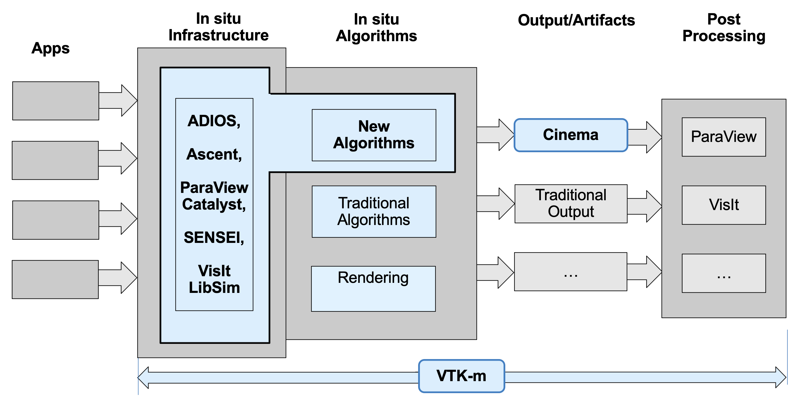

---

# ECP Calls for the use of in-situ workflows


- Algorithms produce artifacts in permanent storage
- Those artifacts:
    - Will be very different from our current artifacts in permanent storage
    - Will need different application support to explore them 
    - Will themselves be inputs to analysis workflows
- Cinema is a project dedicated to these requirements

<br></br>
## Today we wil work with basic examples

---

# Algorithm-based data extraction is a change ...


---

# What is Cinema?


Cinema is and ecosystem consisting of:

- database specification,
- database writers
- database viewers
- algorithms

designed to help explore extreme scale data.

---

# The Cinema Ecosystem?


---

# Important Terms

- **Cinema database:** a set of data in permanent storage, as described by the Cinema Specification, consisting of **artifacts** and parameters.

- **Artifact (Extract):** a logical collection of data in permanent storage
    - example: a set of images
    - example: a set of graphs
    - example: a simulation grid
    - example: `.vti` file
---

# Online Resources

- This Tutorial
    - https://github.com/cinemascience/cinema_tutorial
- Cinema website
    - http://www.cinemascience.org
- Cinema github
    - https://github.com/cinemascience
- Cinema viewer examples
    - http://www.cinemaviewer.org
- Cinema Examples for ECP 2018 Review
    - http://portal.nersc.gov/project/alpine/2018_ECPReview_Cinema/review.new.html

---

# Cinema Website


- Examples (videos)
- Links to code repositories
- Links to expanded documentation

---

# Cinema Website Documentation


- Summarized code examples
- Third party partner instructions
	- ParaView
	- VisIt
- Example datasets

---

# Cinema Github Repositories


- `cinemascience` group
- All public released and in-progress code
	- See individual projects for status

---

# Cinema Examples for ECP 2018 Review


- ECP app examples for 2018 review
- View of ongoing workflow development for ECP app analysis and tasks

---

# How to follow along ...

- `git clone git@github.com:cinemascience/cinema_tutorial.git`
- `cd cinema_tutorial`
- open `tutorial.html` in the browser of your choice
- open a terminal in the `cinema_tutorial` directory
---

# A note about Cinema Viewers and browser permissions 

- Safari
    - Safari->Preferences->Advanced->Show Develop menu in menu bar
    - Safari->Develop->Disable Local File Restrictions (on)
    - **NOTE:** Reset file restrictions when you are done
- Firefox
    - No setting changes needed
- Chrome (exit Chrome)
    - use --disable-web-security command line option for this session
    - `open_tutorial` file has an example for Mac


---

# Coder Information: Digging into Cinema Databases


A Cinema database is a set of artifacts, parameters and semantics.

- [Cinema Specification](https://github.com/cinemascience/cinema/blob/master/specs/dietrich/01/cinema_specD_v012.pdf)
    - Describes the format (csv), and a minimal set of restrictions on the data.
    - A set of artifacts, and parameters associated with those files.
    - Note that location of artifacts is not restricted by specification (can be local or remote), but for simplicity, this tutorial covers local examples.

---

# A hand-editable example of a Cinema Database

No matter how complex, all Cinema databases have the same elements.

```
example_01.cdb/
    data.csv (parameters)

example_02.cdb/
    data.csv (parameters)
    01.png   (artifact files)
    02.png
    03.png
    ...
```

Other data can reside in the `<>.cdb` directory, and is not controlled by the spec.

---

# How would you create one from scratch? 

- Use Case: you have a set of images defined by some parameters (say, time ...)

```
data/
    x-42.png
    x-43.png
    x-44.png
    x-45.png
    x-46.png
    x-48.png
...
```

---

# Cinema Database

Create a `data.csv` file, according to the specification:

Format is `(parameters)(artifacts)`.

```
time,FILE
42,x-42.png
43,x-43.png
44,x-44.png
45,x-45.png
46,x-46.png
48,x-48.png
49,x-49.png
50,x-50.png
52,x-52.png
53,x-53.png
...
```
---

# That's it ... 

```
data/
    data.csv
    x-42.png
    x-43.png
    x-44.png
    x-45.png
    x-46.png
    x-48.png
...
```

---

# Now you can explore this in a viewer 


Explore this with a Cinema viewer, and scroll through the images using the parameter sliders.

- `Halo Dataset` link in **tutorial home page** 
- Works for any number of parameters
- Works for any number of artifacts

---

# A sample database with a few more parameters


- `Volume Dataset` entry in **tutorial home page** 

---

# But ... Data Is 'Messy' 

- Smoothly varying databases are nice, and typically come from simulations
	- Typically have all values expected - entire `data.csv` is populated
- But real world data can be messy, and this is valid per the spec
    - `NaN`, empty values are fine
    - viewers, algs are expected to properly deal with this 

```
temp,pressure,vel,time,FILE
3.0,1.0,,1.0,results/1.csv
3.1,2.0,45.6,1.0,results/2.csv
3.3,3.0,45.6,1.0,results/3.csv
4.0,NaN,45.6,1.0,results/4.csv
...
```
---

# A multi-artifact Cinema database

- A database can have multiple artifacts
	- Example: `materials/data/multi_artifact.cdb`
    - The database has the same organization as before:
	- `(set of parameters)(set of artifacts)`

```
theta,phi,vti x-radius,pdb,FILE,FILE_VTI,FILE_PDB
0,-180,10,good,image/-180/0.png,wavelet/10.vti,good.pdb
0,-162,20,N/A,image/-162/0.png,wavelet/20.vti,
0,-144,30,N/A,image/-144/0.png,wavelet/30.vti,
0,-126,40,N/A,image/-126/0.png,,
...
``` 

---

# Cinema Explorer viewer supports multiple data types 


- `Cinema Explorer` link in **tutorial home page** 
- select "Multiple Artifacts" from the database list at the top, press `load` button

---

# Cinema Explorer viewer supports multiple data types 


When viewing this data, `Cinema:Explorer` shows thumbnails for each type of data that it can view.

- Clicking on the thumbnail brings up an appropriate viewer for that type of data, if possible.
- **NOTE:** `Cinema:Explorer` indicates which types of files it doesn't have viewers for.

---

# Cinema Explorer viewer supports multiple data types 


ParaView/VTK `.vti` files can be interactively viewed ...

---

# Cinema Explorer viewer supports multiple data types 

ParaView/VTK `.pdb` files can be interactively viewed ...

---

# How else can we create a Cinema database?


- Directly output Cinema from your code
    - Refer to the specification
- ASCENT
    - **in-situ** output 
- ParaView
    - application
    - **in-situ:** ParaView catalyst (instructions on cinema website)
- VisIt 
    - application (instructions on cinema website)

<!-- TODO add montage diagram, including ASCENT example (get from Matt)-->

---

# Application export example

---

# ParaView v5.5


- We've created a sphere source

---

# ParaView v5.5


- Choose `File->Export Scene...`
- Choose default option for `Files of Type`
	-`Cinema Database (*.cdb)`

---

# ParaView v5.5


- Turn off `Composite` option
- Select `Camera Type` of `phi-theta`
- Click `Save`
- ParaView will export a database
- **Note:** this output needs to be upgraded to current spec with `cinema` command line tool
- **Note:** there is a bug in single-timestep exports in PV 5.6

---

# View Resulting Database in `cinema:compare`


- `Sphere Database Comparison` link on **tutorial home page**

<br></br>
<br></br>

## ... so how do we use the viewers?


---

# Cinema Viewers


`cinemascience` github organization includes several viewer repositories

- **Cinema:Components**, reusable browser-based components for viewers.
- **Cinema:Compare**, a basic viewer to compare several databases.
- **Cinema:Explorer**, a more full-featured viewer to explore databases.
- **Cinema:Scope**, a cross-platform viewer application under development.

---

# Cinema Viewers


Viewers and components can be used in a variety of ways:

- Small files saved along with Cinema databases
	- Useful when web access is restricted
    - Requires no infrastructure support
        - Ease of support
        - Long shelf life
- Online, through web server 
	- Common use case
    - Cinema will be supported natively on ECP Concur

---

# Coder Information: Cinema Components 


- `cinema_components` is a set of reusable javascript components
	- artifact query viewer
	- parallel coordinates browser
	- graphs
	- database loading components
- github repository includes detailed examples and docs

---

# Cinema Components
- Repository and examples: `https://github.com/cinemascience/cinema_components`
    - distributed online, so include these in your own viewers with:
```
<head>
<script 
src='https://cinemascience.github.io/release/CinemaComponents.v2.6.2.min.js'>
</script>`
</head>
```

---

# Viewer `Cinema:Compare`

Browser-based basic viewer for image-based output

- Basic viewer, can be easily edited to view multiple databases
- Sliders control all windows
- `Cinema:Compare` will do its best to show images as the parameters are manipulated (missing images will not cause problems).

---

# Viewer `Cinema:Compare`
To modify this application, edit the `index.html` file to point to a list of databases you'd like to view:

- tutorial file: `materials/databases.json`

```
<!doctype html>
<html>

<head>
    <meta charset="utf-8">
    <link rel='stylesheet' href='cinema/compare/1.0/css/compare.css'>
    <link rel='stylesheet' href='cinema/compare/1.0/css/common.css'>
    <script src='https://d3js.org/d3.v4.min.js'></script>
</head>
...
    // START: Array of databases to view
    var dataSets = [ "data/sphere.cdb", "data/sphere.cdb" ];
    // END : Array of databases to view
...
```

---

# Viewer `Cinema:Explorer`

Browser-based Explorer for general databases

---

# Cinema:Explorer
To use this application, edit the `databases.json` file referenced in the html:

```
[
    {
        "name" : "sphere",
        "directory" : "data/sphere.cdb"
    },
    {
        "name" : "Sphere Multi-Image",
        "directory" : "data/sphere_multi-image.cdb"
    },
    {
        "name" : "Multiple Artifacts",
        "directory" : "data/multiple_artifact.cdb"
    }
]
```


---

# Cinema:Scope


- Cross-platform Qt-based viewer
- Includes reusable classes for loading and interacting with Cinema databases
- Initial release scheduled for March 2019 Cinema release cycle.
- Travis CI, building on Linux, OSX and Windows

<br>

`git@github.com:cinemascience/cinema_scope.git`


---

# Coder Information: Cinema Algorithms


A command line tool with set of algorithms that operate on Cinema databases. 

- algorithms can generate new **artifacts**, as well as new **parameters** about the artifacts.

`git@github.com:cinemascience/cinema_lib.git`

---

# Coder Information: Cinema Algorithms


Cinema command line tool support the following general operations:

- Verification of databases 
- Conversion/Upgrade of database formats
- Meta data operations
    - create new parameters, such as change detection, edge detection, etc.
- Artifact operations
    - create new data artifacts, and add them to the database

---

# Cinema Command line tool


- Requirements
    - python 3.6
    - advanced features require:
        - nympy, scipy, scikit-image, opencv
- Clone repository, and install with `pip`
	- instructions and examples in repository

<br></br>
`git@github.com:cinemascience/cinema_lib.git`


---

# Cinema Command Line Algorithm Example

- General form of a command:
	- `cinema -d (database) --command (column ID to operate on)
- What happens
	- original `data.csv` is copied to `data.(timestamp)`
	- new data is added to `data.csv`
- Algorithms
	- image-space algorithms are domain independent
	- parameter algorithms are domain independent

---

# Cinema Command Line Algorithm Example


---

# Cinema Command Line Algorithm Example

**Data:** rendered images and timestep parameters.

**Task:** find, count edges and show edges in images.

<table>
<tr>
    <td>
    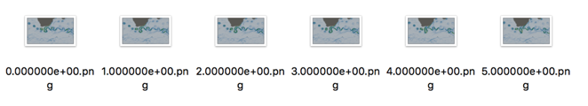
    </td>
    <td>
    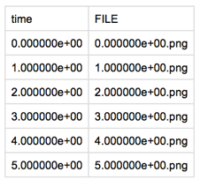
    </td>
</tr>
</table>

---

# Cinema Command Line Algorithm Example

Generate greyscale images and add them to the database:
- `cinema -d ocean.cdb --image-grey 1`

<table>
<tr>
    <td>
    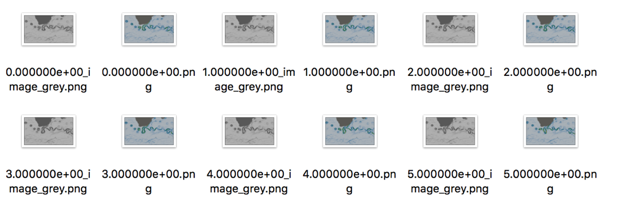
    </td>
    <td>
    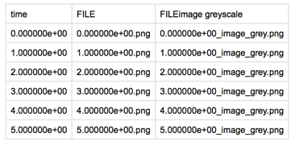
    </td>
</tr>
</table>

---

# Cinema Command Line Algorithm Example

Extract number of edge pixels in each greyscale image
- `cinema -d ocean.cdb --image-canny 2`

<table>
<tr>
    <td>
    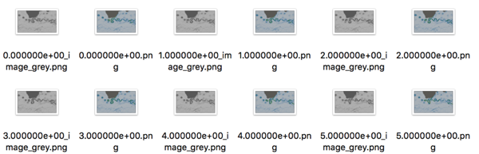
    </td>
    <td>
    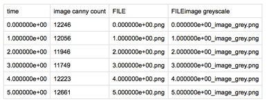
    </td>
</tr>
</table>


---

# Cinema Command Line Algorithm Example

Generate canny edge images of the grayscale images in the database:
- `cinema -d ocean.cdb --cv-canny 3`

<table>
<tr>
    <td>
    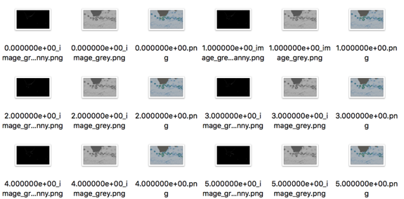
    </td>
    <td>
    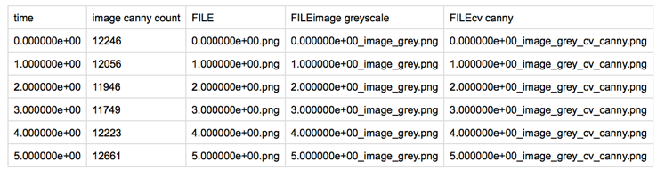
    </td>
</tr>
</table>

---

# Cinema Command Line Algorithm Example
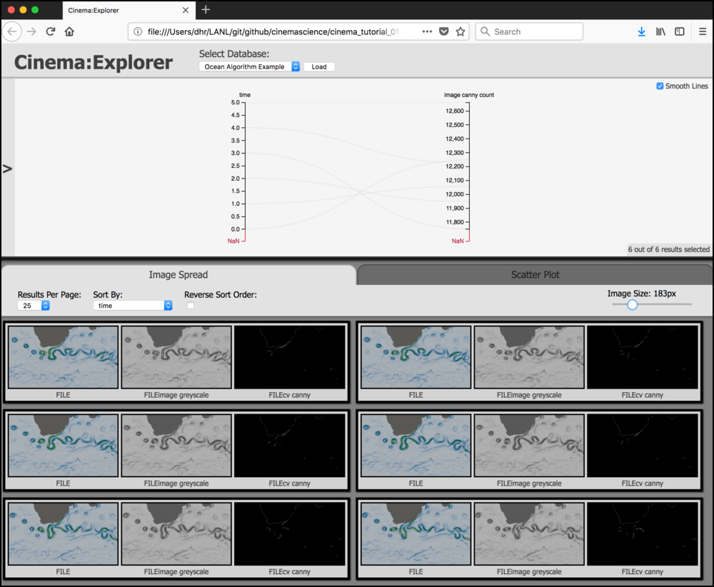

- The database now includes three images and two columns of data.
- `Cinema Explorer` in **tutorial home page**
- Load 'Ocean Algorithm Example`

---

# Algorithm Example, Visualization
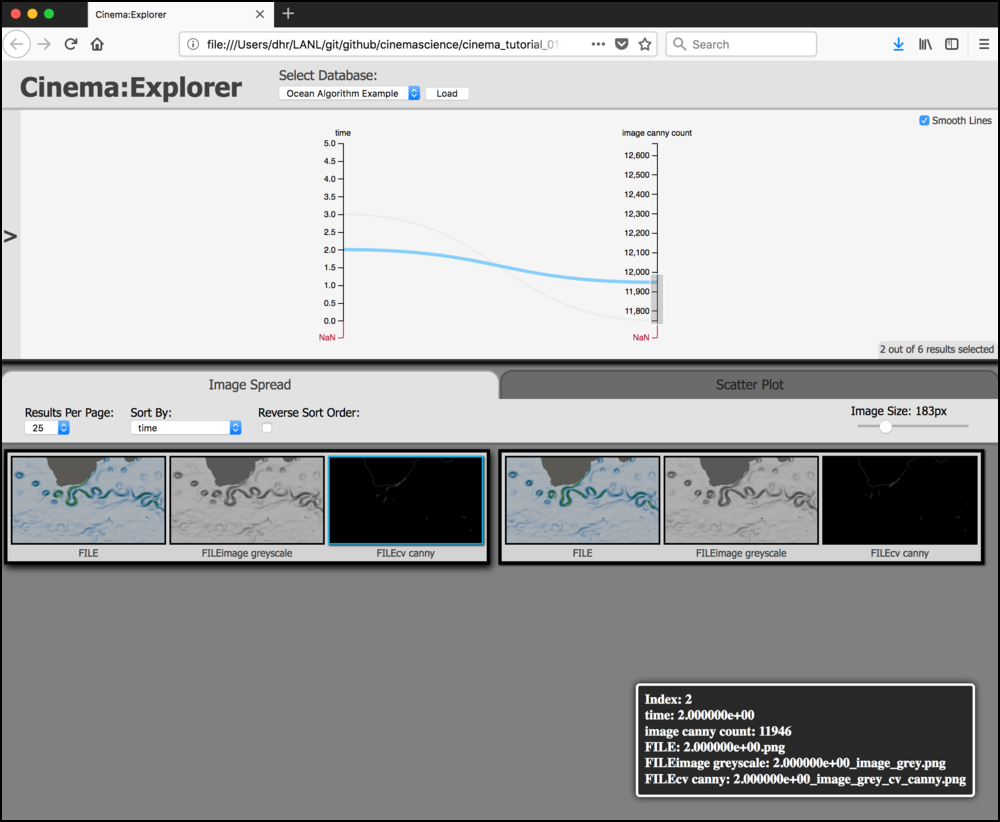

- Using `Cinema:Explorer`, we can select the images that have the highest edge count.

---

# Algorithm Example, Visualization
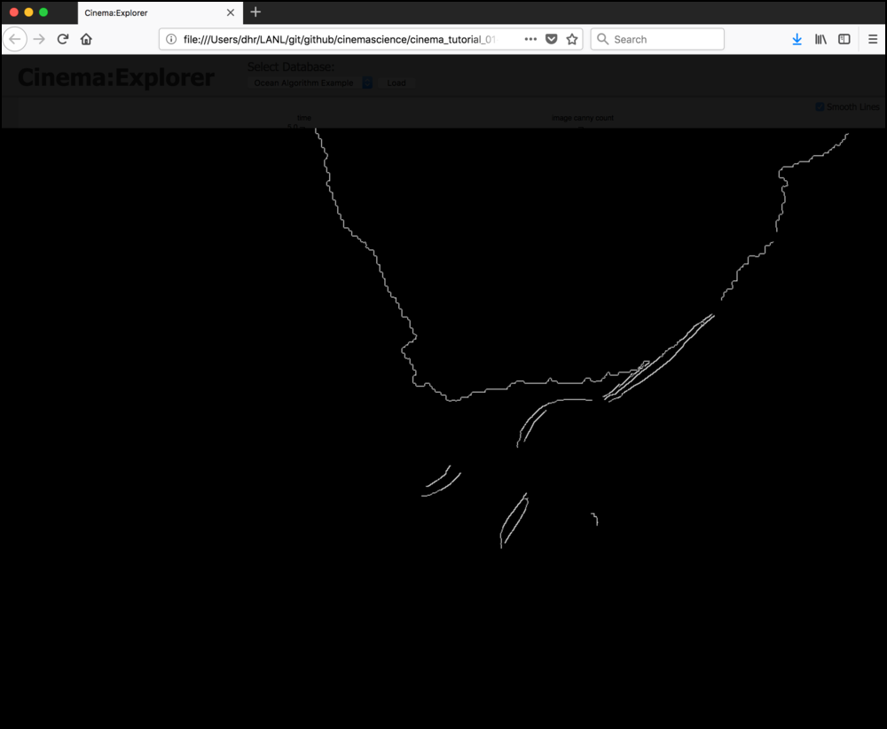

- Clicking on that image shows a zoomed version of the edge detection image.

- You can continue to cycle through applying algorithms and viewing results.

---

# Additional Algorithm Examples
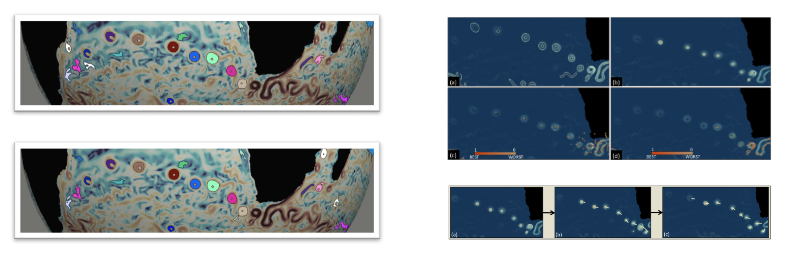

---

# Questions?

---

# Acknowledgements

- Slides created with [`Marp`](https://yhatt.github.io/marp)

